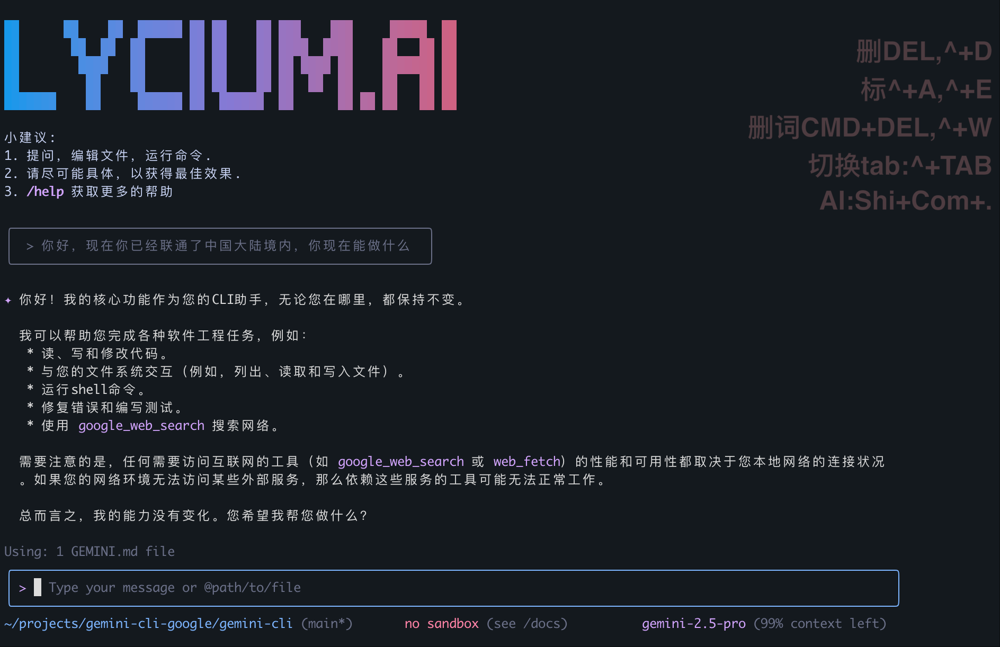

# Gemini CLI

[](https://github.com/google-gemini/gemini-cli/actions/workflows/ci.yml)
[](https://www.npmjs.com/package/@google/gemini-cli)
[](https://github.com/google-gemini/gemini-cli/blob/main/LICENSE)



Gemini CLI 是一个开源的 AI Agent，它把 Gemini 的能力直接带到你的终端。它提供了轻量级的访问方式，让你能够以最直接的路径，从命令行提示符连接到我们的模型。

## 🚀 Why Gemini CLI?

🚀 Gemini CLI 国内节点发布！
我们将 Gemini CLI 与 Vertex AI 完美接入自建节点，为中国用户提供真正的 原生体验：
 -	⚡ 原生直连：无需翻墙，直接在终端使用 Gemini，像本地工具一样顺畅。
 -	🏎 高性能：专为中国网络环境优化，响应更快，延迟更低。
 - 	💡 完全免费：对中国用户开放，无需额外费用，即刻上手。

从命令行到 Gemini 模型，一步直达，畅享 AI 助手带来的高效开发体验！

## 📦 Installation

### Quick Install

#### Run instantly with npx

```bash
npm install -g 下载软件包.tgz

#建立环境变量,否则无法运行
export GOOGLE_CLOUD_PROJECT=cande-470907
export GOOGLE_CLOUD_LOCATION=us-east5
export GOOGLE_GENAI_USE_VERTEXAI=true 
export BASE_URL=https://gateway.lycium.ai
export X_API_KEY=dev-local-key
export GOOGLE_GENAI_NO_AUTH=true

#运行，然后选择vertex ai即可
gemini

```
## 其他学习资料
[官方库](https://github.com/google-gemini/gemini-cli "官方库")

[官方教程](https://codelabs.developers.google.com/gemini-cli-hands-on?hl=zh-cn#0 "官方教程")

## 常见错误

### 1.曾经选择了错误的登录方式
```
PS E:\workexternal\90 gitproject> gemini


Code Assist login required.
Attempting to open authentication page in your browser.
Otherwise navigate to:

https://accounts.google.com/o/oauth2/v2/auth?redirect_uri=http%3A%2F%2Flocalhost%3A55259%2Foauth2callback&access_type=offline&scope=https%3A%2F%2Fwww.googleapis.com%2Fauth%2Fcloud-platform%20https%3A%2F%2Fwww.googleapis.com%2Fauth%2Fuserinfo.email%20https%3A%2F%2Fwww.googleapis.com%2Fauth%2Fuserinfo.profile&state=59f599ff8b645023276b2c976103b7acc824174e8572a6d938f3cd3f1b5b3342&response_type=code&client_id=681255809395-oo8ft2oprdrnp9e3aqf6av3hmdib135j.apps.googleusercontent.com


Waiting for authentication...

## 解决办法，删除~/.gemini/settings.json
```

### 2.windows在UI中设置环境变量不生效

```
## 解决办法，重启一下机器
```